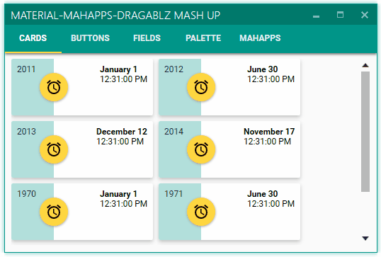
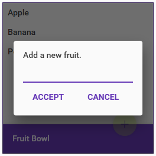

#  Material Design In XAML Toolkit



###### [More pics below](#MorePics)

#  Summary

 * XAML Resources for [Google swatches displayed](http://www.google.co.uk/design/spec/style/color.html#color-ui-color-application)
 * WPF control themes
 * Small sample apps within solution showing how to include chosen colours and use the resources:
   * MaterialDesignColors.WpfExample - illustrates palette use and control themes in WPF
   * MahMaterialDragablzMashUp - illustrates combination of [Dragablz](https://github.com/ButchersBoy/Dragablz), [MahApps](https://github.com/MahApps/MahApps.Metro), and Material Design for saweet UI.
   * MaterialDesignColors.UniversalExample - illustrates palette use in WinRT
 * Compatible with [MahApps](http://mahapps.com) and [Dragablz](https://github.com/ButchersBoy/Dragablz).  See demo app in source and [Mash Up! blog](http://dragablz.net/2015/02/25/material-design-in-xaml-mash-up/).
 * Includes hacky console app which was used to generate the XAML colour definitions

[](https://gitter.im/ButchersBoy/MaterialDesignInXamlToolkit)
[](https://ci.appveyor.com/project/ButchersBoy/materialdesigninxamltoolkit)
[](https://www.nuget.org/packages/MaterialDesignThemes/)
[](https://www.nuget.org/packages/MaterialDesignColors/)
[](https://github.com/ButchersBoy/MaterialDesignInXamlToolkit/issues)
[](https://twitter.com/James_Willock)

#  Source Code
To load the source project you will need Visual Studio 2015.  Don't worry if you have an earlier version, you can still use the compiled assemblies from NuGet (see below).  There are two demo projects in the solution, restore the NuGet packages and fire them both up.  One is a "pure" Material Design project, the other illustrates how to combine with Dragablz & MahApps.

#  How Can I Use The Themes?

* Install [NuGet package](https://www.nuget.org/packages/MaterialDesignThemes/) ```Install-Package MaterialDesignThemes```
* Configure App.xaml according to the [example](MainDemo.Wpf/App.xaml).
* For more information see the [Get Started guide](http://materialdesigninxaml.net/#getStarted).

#  Mentions

* Logo courtesy of GitHub user [Snalty](https://github.com/snalty), and you can see more of him;
 * on his [blog](http://holothere.tumblr.com/)
 * and on [Twitter](https://twitter.com/snalty)
* Marc Angers - I pulled some oh his shadows straight in from this [blog post](http://marcangers.com/material-design-shadows-in-wpf/)
* Most of the icons come from [Material Design Icons](https://materialdesignicons.com/)...check it!
* Ignace Maes, whose [Material Skin](https://github.com/IgnaceMaes/MaterialSkin) project inspired the original material design theme for [Dragablz](https://github.com/ButchersBoy/Dragablz), which in turn led to me starting this project
* **[Contributors!](https://github.com/ButchersBoy/MaterialDesignInXamlToolkit/graphs/contributors)**  Thanks for the PRs which have helped add some extra polish.  

# <a name="MorePics"></a> More Pics





