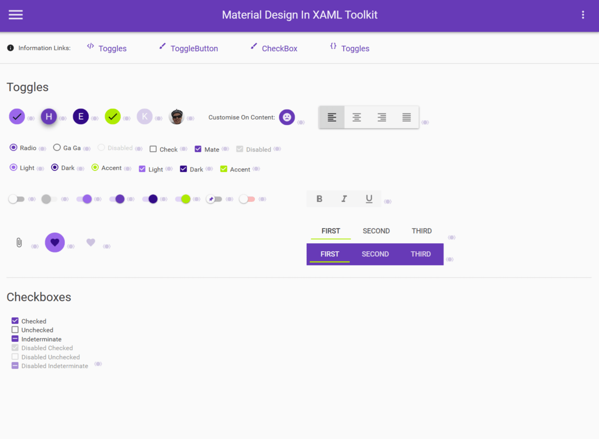

<!-- omit in toc -->
# Material Design In XAML Toolkit 

[](https://www.nuget.org/packages/MaterialDesignThemes/)
[](https://www.nuget.org/packages/MaterialDesignColors/)

[)](https://www.nuget.org/packages/MaterialDesignThemes/)
[)](https://www.nuget.org/packages/MaterialDesignColors/)

[](#backers) 
[](#sponsors) 
[][discord-server-url]
[](https://github.com/MaterialDesignInXAML/MaterialDesignInXamlToolkit/issues)


Comprehensive and easy to use Material Design theme and control library for the Windows desktop (WPF).

- Material Design styles for all major WPF Framework controls
- Additional controls to support the theme, including Multi Action Button, Cards, Dialogs, Clock
- Easy configuration of palette (at design _and_ runtime), according to [Google's guidelines](https://material.io/design/)
- Full [Material Design Icons](https://materialdesignicons.com/) icon pack
- Easy transition effects
- Compatible with [Dragablz](https://github.com/ButchersBoy/Dragablz), [MahApps](https://github.com/MahApps/MahApps.Metro)
- Demo applications included in the source project

[See screenshots](#screenshots)

<details>
  <summary>Table of contents</summary>

- [Getting started](#getting-started)
- [Building the source](#building-the-source)
- [Screenshots](#screenshots)
- [More examples](#more-examples)
- [FAQ](#faq)
- [Contributing](#contributing)
- [Mentions](#mentions)
- [Backers](#backers)
- [Sponsors](#sponsors)

</details>

---

## Getting started

> [!NOTE]
> See the [full starting guide](https://github.com/MaterialDesignInXAML/MaterialDesignInXamlToolkit/wiki/Getting-Started) for more in-depth information.

This quick guide assumes you have already created a WPF project and are using Microsoft Visual Studio 2022.

* Install the toolkit through the visual NuGet package manager in Visual Studio or use the following command:
```
Install-Package MaterialDesignThemes
```
* Alter your `App.xaml`

```xml
<Application 
  x:Class="Example.App"
  xmlns="http://schemas.microsoft.com/winfx/2006/xaml/presentation"
  xmlns:x="http://schemas.microsoft.com/winfx/2006/xaml"
  xmlns:materialDesign="http://materialdesigninxaml.net/winfx/xaml/themes"
  StartupUri="MainWindow.xaml">
    <Application.Resources>
        <ResourceDictionary>
            <ResourceDictionary.MergedDictionaries>
                <materialDesign:BundledTheme BaseTheme="Light" PrimaryColor="DeepPurple" SecondaryColor="Lime" />

                <ResourceDictionary Source="pack://application:,,,/MaterialDesignThemes.Wpf;component/Themes/MaterialDesign2.Defaults.xaml" /> 
            </ResourceDictionary.MergedDictionaries>
        </ResourceDictionary>
    </Application.Resources>
</Application>
```
* If you want to target Material Design 3, alter the `ResourceDictionary` line in the snippet above to use `MaterialDesign3.Defaults.xaml`.

* Alter your `MainWindow.xaml`

```xml
<Window [...]
  Style="{StaticResource MaterialDesignWindow}"
  [...] >
```


## Building the source

To build the project, following is required:
* Microsoft Visual Studio 2022
* .NET desktop development workload

This repository also contains 3 different demo applications:
* `MaterialDesignDemo` - Reference WPF app with Material Design 2 styling, this contains all controls and is a recommended tool when developing apps with this library
* `MaterialDesign3Demo` - Reference WPF app with Material Design 3 styling, under development
* `MahAppsDragablzDemo` - Demo app for combining with Dragablz and MahApps

## Screenshots

> [!WARNING]
> The screenshots below are taken from the Material Design 2 demo app.
> It is possible that these are out of date. Run the demo app from latest source to see the latest version.

<details>
  <summary>Show images</summary>

  
  
  
  
  
  
  
  
  
  
  
  
  
  
  
  
  
  
  
  
  
</details>


## More examples

* [Keboo/MaterialDesign.Examples](https://github.com/Keboo/MaterialDesignInXaml.Examples)
* [doobry](http://materialdesigninxaml.net/doobry)
* [F1ix](http://materialdesigninxaml.net/f1ix)
* [Motion List](https://github.com/MaterialDesignInXAML/MotionList)

## FAQ

* [How to increase rendering performance?](docs/rendering-performance.md)

## Contributing

Before contributing code read the [Contribution Guidelines](.github/CONTRIBUTING.md)
* GitHub issues are for bugs and feature requests.
* For questions, help and chat in general, please use the [GitHub discussion tab](https://github.com/MaterialDesignInXAML/MaterialDesignInXamlToolkit/discussions) or the [Discord server][discord-server-url].
* Stack Overflow tag: [`material-design-in-xaml`](http://stackoverflow.com/questions/tagged/material-design-in-xaml)

Want to say thanks? 🙏🏻
* Hit the :star: star :star: button
* If you'd like to make a very much appreciated financial donation please visit <a href='https://opencollective.com/materialdesigninxaml'>open collective</a>

This project exists thanks to all the people who contribute.

<a href="https://github.com/MaterialDesignInXAML/MaterialDesignInXamlToolkit/graphs/contributors">
  
</a>

## Mentions

- **[James Willock](https://github.com/ButchersBoy)
[](https://twitter.com/James_Willock)** - Founder of the project
- **[Kevin Bost](https://github.com/Keboo)
[](https://twitter.com/kitokeboo)** - Maintainer of the repository
- [Snalty](https://github.com/snalty)
[](https://twitter.com/snalty) - Designer of the logo
- Icon pack sourced from [Material Design Icons](https://materialdesignicons.com/)
- [ControlzEx](https://github.com/ControlzEx/ControlzEx) - Library used in MaterialDesignInXAML
- [Ignace Maes](https://github.com/IgnaceMaes) - Whose [Material Skin](https://github.com/IgnaceMaes/MaterialSkin) project inspired the original material design theme for [Dragablz](https://github.com/ButchersBoy/Dragablz), which in turn led James Willock start this project
- [Material Design Extensions](https://github.com/spiegelp/MaterialDesignExtensions) - A community repository based on this library that provides additional controls and features.
- **[Contributors](https://github.com/MaterialDesignInXAML/MaterialDesignInXamlToolkit/graphs/contributors)** - A big thank you to all the contributors of the project!

## Backers

Thank you to all our backers! 🙏 [Become a backer.](https://opencollective.com/materialdesigninxaml#backer)

<a href="https://opencollective.com/materialdesigninxaml#backers" target="_blank"></a>

## Sponsors

Support this project by becoming a sponsor. Your logo will show up here with a link to your website. [Become a sponsor.](https://opencollective.com/materialdesigninxaml#sponsor)

<a href="https://opencollective.com/materialdesigninxaml/sponsor/0/website" target="_blank"></a>
<a href="https://opencollective.com/materialdesigninxaml/sponsor/1/website" target="_blank"></a>
<a href="https://opencollective.com/materialdesigninxaml/sponsor/2/website" target="_blank"></a>
<a href="https://opencollective.com/materialdesigninxaml/sponsor/3/website" target="_blank"></a>
<a href="https://opencollective.com/materialdesigninxaml/sponsor/4/website" target="_blank"></a>
<a href="https://opencollective.com/materialdesigninxaml/sponsor/5/website" target="_blank"></a>
<a href="https://opencollective.com/materialdesigninxaml/sponsor/6/website" target="_blank"></a>
<a href="https://opencollective.com/materialdesigninxaml/sponsor/7/website" target="_blank"></a>
<a href="https://opencollective.com/materialdesigninxaml/sponsor/8/website" target="_blank"></a>
<a href="https://opencollective.com/materialdesigninxaml/sponsor/9/website" target="_blank"></a>

[discord-server-url]: https://discord.keboo.dev